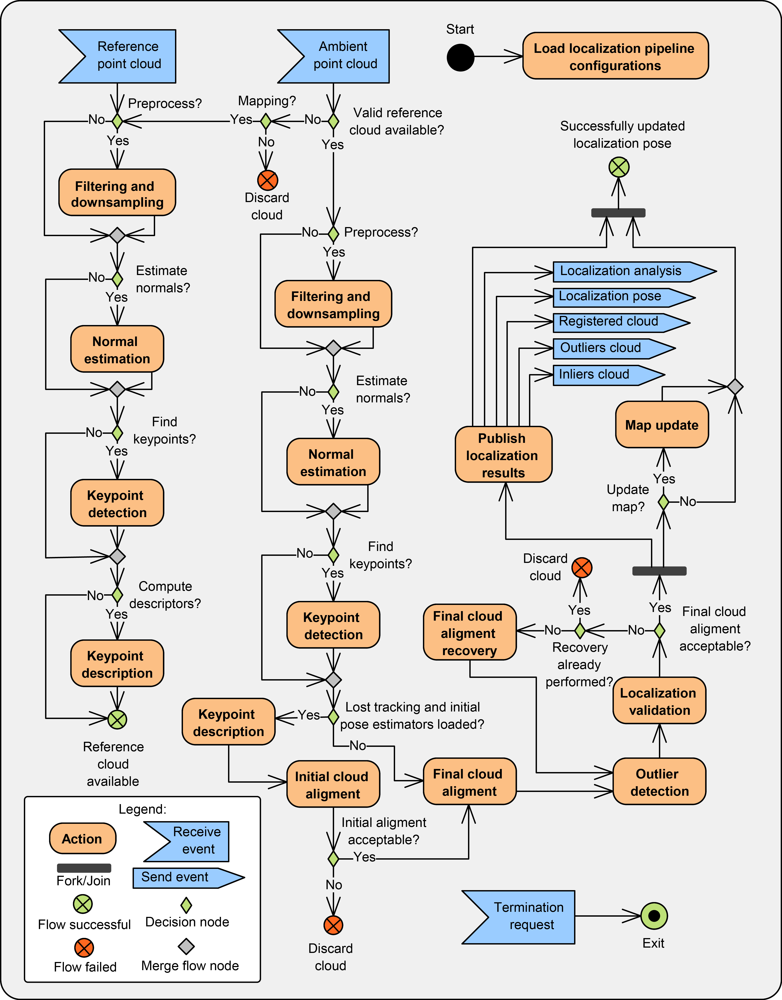

Dynamic Robot Localization
==================

## Overview

The dynamic\_robot\_localization is a [ROS](http://www.ros.org) package that offers 3 DoF and 6 DoF localization using PCL and allows dynamic map update using OctoMap.
It's a modular localization pipeline, that can be configured using yaml files (detailed configuration layout available in [drl_configs.yaml](yaml/schema/drl_configs.yaml) and examples of configurations available in [guardian_config](https://github.com/inesc-tec-robotics/guardian_config/blob/hydro-devel/localization/guardian_localization.launch) and [dynamic_robot_localization_tests](https://github.com/carlosmccosta/dynamic_robot_localization_tests/tree/hydro-devel/launch/environments)).

Even though this package was developed for robot self-localization, it was implemented as a generic, configurable and extensible point cloud matching library, allowing its usage in related problems such as [estimation of the 6 DoF pose of an object](https://www.youtube.com/watch?v=557vglPW6Ko) and 3D object scanning.

Figure 1: Localization system processing pipeline

Video 1: 3 DoF localization and navigation tests with the Guardian platform in the CROB lab

Video 2: 3 DoF localization and navigation tests with the Guardian platform in ship interior

Video 3: 3 DoF localization, navigation and welding tests with the Guardian platform in ship interior

Video 4: 3 DoF localization system tests with the Jarvis platform in the CROB lab

Video 5: 3 DoF localization system tests with the Pioneer platform in the TUM RGB-D dataset

Video 6: Free fly test with Kinect in the ETHZ RGB-D dataset using the 6 DoF localization system

Video 7: Rotations test with Kinect in the ETHZ RGB-D dataset using the 6 DoF localization system

Video 8: 3 DoF localization system tests with the Guardian platform in Labiomep dataset

Video 9: Mapping with the Guardian robot in simulated ship interior using the 3 DoF localization system

Video 10: Free fly mapping test with Kinect in the ETHZ RGB-D dataset using the 6 DoF localization system

Video 11: Object pose estimation for assisted assembly operations

## Data sources

The localization system can operate with any type of sensors that provide point clouds.
As such, it can use any number of laser sensors (by using the [laserscan_to_pointcloud](https://github.com/carlosmccosta/laserscan_to_pointcloud) package) or RGB-D / ToF cameras.

## Reference map

The reference map can be provided to the localization system from CAD ( .ply | .stl | .obj | .vtk ), pointcloud file (.pcd) / topic (sensor_msgs::PointCloud2) or using a 2D costmap (nav_msgs::OccupancyGrid).
To avoid unnecessary overhead it should be provided has pointcloud (.pcd).

To convert CAD files to .pcd there are two options:

1. Using [conversion scripts](tools) that filter the CAD using meshlabserver, add point curvature information and convert the CAD to .pcd (recommended)
 - Supported file types: .3ds .aln .apts .asc .dae .gts .obj .off .ply .pts .ptx .stl .tri .v3d .vrml .x3d .x3dv .xyz
2. Using the [mesh_to_pointcloud](https://github.com/carlosmccosta/mesh_to_pointcloud) package that converts CAD to .pcd directly (without curvature and filtering)
 - Supported file types: .3dc .3ds .asc .ac .bsp .dae .dw .dxf .fbx .flt .gem .geo .iv .ive .logo .lwo .lw .lws .md2 .obj .ogr .osg .pfb .ply .shp .stl .x .wrl

## Localization methods

The localization system has two different localization methods to tackle different scenarios.

For initial pose estimation and pose recovery it can use feature matching with several keypoint detectors (such as Scale Invariant Feature Transform (SIFT) and Intrinsic Shape Signatures (ISS3D)) and several keypoint descriptors (such as Point Feature Histogram (PFH), Fast Point Feature Histogram (FPFH), Signature of Histograms of Orientations (SHOT), Shape Context 3D (SC3D), Unique Shape Context (USC) and Ensemble of Shape Functions (ESF)).

For pose tracking it can use several variants of the Iterative Closest Point algorithm and also the Normal Distributions Transform (NDT).
Moreover, pose tracking can have two configurations. One tuned for the expected operation conditions of the robot and another able to recover from odometry estimation problems (the system can operate without odometry).

This gives the possibility to have a configuration that can perform pose tracking with the minimum amount of computational resources required (such as point-to-point ICP) and a more robust (and computational expensive) configuration to handle temporary tracking problems (such as point-to-point non linear ICP, point-to-plane ICP, generalized ICP).
Examples of the localization pipeline are available at [dynamic_robot_localization/yaml/configs](yaml/configs)

## Localization reliability

The localization pipeline allows the attachment of transformation validators before publishing pose estimations.

They can be used to suppress estimations that are not plausible for a given robot operation conditions.

These validators can suppress localization estimations in which the pose correction has a [ outlier percentage | inliers root mean square error | inliers / outliers angular distribution | translation / rotation corrections ] outside acceptable thresholds.

If the tracking methods can't recover after a given amount of sensor updates / time, the initial pose estimation (using features) can be activated.

## Dynamic map update

Dynamic map update can be performed with / without surface reconstruction and can also be coupled with the [OctoMap](http://octomap.github.io/) package in order to perform probabilistic point cloud integration (useful for dynamic environments in which large objects may appear / disappear),

This can be by setting the reference_pointclouds/reference_pointcloud_update_mode parameter to one of the available integration modes (NoIntegration | FullIntegration | InliersIntegration | OutliersIntegration) and configuring [OctoMap](launch/octo_map.launch) to use the registered cloud or the inlier / outlier cloud as input (and the output of OctoMap as the reference cloud for the localization system).

## Usage

The localization system can be started with [dynamic_robot_localization_system.launch](launch/dynamic_robot_localization_system.launch)

This launch file starts the nodes:

* dynamic_robot_localization
* pose_to_tf_publisher (can be disabled)
* laserscan_to_pointcloud_assembler (can be disabled)
* octomap (can be disabled)

The localization is integrated with other ROS nodes by publishing TF transforms between map and odom frames (configurable frame names) using the [pose_to_tf_publisher](https://github.com/carlosmccosta/pose_to_tf_publisher) node.

The initial pose can be given in yaml / roslaunch files or dynamically using [geometry_msgs::PoseStamped](http://docs.ros.org/api/geometry_msgs/html/msg/PoseStamped.html) / [geometry_msgs::PoseWithCovarianceStamped](http://docs.ros.org/api/geometry_msgs/html/msg/PoseWithCovarianceStamped.html) topics / rviz.

The dynamic_robot_localization node publishes [geometry_msgs::PoseStamped](http://docs.ros.org/api/geometry_msgs/html/msg/PoseStamped.html) / [geometry_msgs::PoseWithCovarianceStamped](http://docs.ros.org/api/geometry_msgs/html/msg/PoseWithCovarianceStamped.html) that are received by pose_to_tf_publisher and converted to TF messages.

The TF is published in a separate ROS node to ensure that the system remains operational and with constant TF publish rate even if the localization node has variable computational time.

Moreover, in the remote case that the localization system crashes (by lack of system resources, programming error in the localization node or in one of its external libraries), the system can remain operational using only odometry for a given amount of time (i.e. TF messages can be published continuously, with a timeout counted after the last valid pose estimation or one message for each pose estimation) and the localization node can be automatically restarted (has node respawn activated) without any impact in the rest of the system.

The dynamic_robot_localization node publishes in latched topics (if required, as the publish of these messages can be disabled to reduce consumption of system resources):

1. dynamic_robot_localization::LocalizationDetailed
 - Message that has detailed information about the localization estimation (number of registered points | number of inliers | outlier percentage | inliers root mean square error | inliers / outliers angular distribution | translation / rotation corrections | global estimation accepted poses)
2. dynamic_robot_localization::LocalizationTimes
 - Message with the computation time of each localization processing stage (and also the global time)
3. dynamic_robot_localization::LocalizationDiagnostics
 - Message with diagnostics (currently only has the point clouds size after each major localization pipeline stages)
4. Registered clouds (sensor_msgs::PointCloud2)
 - The full registered cloud or its points categorized as inliers / outliers (computed in each pose estimation) is also published as 3 separated point clouds.
5. Reference point cloud (sensor_msgs::PointCloud2)
 - The current reference point cloud is also published in order to be available to localization supervisors

## Dynamic robot localization tests

The main tests performed using the dynamic_robot_localization package are available in [dynamic_robot_localization_tests](https://github.com/carlosmccosta/dynamic_robot_localization_tests).

## Installation and package dependencies

After [installing and setting up ROS](http://wiki.ros.org/ROS/Installation), the installation scripts in the [install folder](install/) can be used to setup this package.

The [install.bash](install/install.bash) has 5 parameters:
* catkin_ws_path=${1:-"$HOME/catkin_ws_drl"}
  - The workspace in which this repository and its dependencies will be cloned (in the src folder)
* number_of_cpu_threads_for_compilation=${2:-2}
  - The number of CPU threads for using during compilation (if your computer has a low amount of RAM and swap, set this variable to 1)
* use_catkin_tools=${3:-true}
  - Flag for indicating if the newer build system [catkin_tools](https://catkin-tools.readthedocs.io/en/latest/migration.html) should be used (if false, the older [catkin_make_isolated](http://www.ros.org/reps/rep-0134.html) command will be used, in order to be able to compile [PCL](https://github.com/PointCloudLibrary/pcl), which is a pure CMake package)
* ros_version=${4:-"$(rosversion -d)"}
  - When several ROS distributions are installed, this parameter can be used to specify which ROS version to use (by default the value is retrieved using the command rosversion -d)
* catkin_ws_path_to_extend=${5:-"/opt/ros/$ros_version"}
  - Parameter for specifying which workspace should be extended
  - This is useful when using [catkin overlays](http://wiki.ros.org/catkin/Tutorials/workspace_overlaying) / [workspace chaining](https://catkin-tools.readthedocs.io/en/latest/mechanics.html#workspace-chaining-extending)

The [install.bash](install/install.bash) script will execute the following accompanying scripts in this order:
* [a_dependencies.bash](install/a_dependencies.bash)
  - Dependencies that can be installed with apt-get
* [b_workspace.bash](install/b_workspace.bash)
  - Setup of the workspace (if an existing workspace is specified, the script will not change the configurations of the workspace)
* [c_repositories.bash](install/c_repositories.bash)
  - Cloning of this repository and its dependencies that must be built from source
* [d_rosped.bash](install/d_rosped.bash)
  - Any remaining transitive dependencies will be installed using rosdep
* [e_build.bash](install/e_build.bash)
  - Building of the packages

It is also provided the [repositories_update.bash](install/repositories_update.bash) script to update the repositories related with this package.

On the other hand, [wstool](http://wiki.ros.org/wstool) can be used since the [c_repositories.bash](install/c_repositories.bash) added the repositories to the .rosintall file

**Notes:**
- The [hydro-devel](https://github.com/carlosmccosta/dynamic_robot_localization/tree/hydro-devel) branch can use PCL 1.7.* from [official PPA](http://pointclouds.org/downloads/linux.html)
- The [kinetic-devel](https://github.com/carlosmccosta/dynamic_robot_localization/tree/kinetic-devel) branch requires to [compile PCL from source](http://www.pointclouds.org/documentation/tutorials/compiling_pcl_posix.php) using branch [master-all-pr](https://github.com/carlosmccosta/pcl/tree/master-all-pr) from [https://github.com/carlosmccosta/pcl](https://github.com/carlosmccosta/pcl)
  - To ensure that the same pcl libraries are used in drl and its dependencies, the following packages should also be compiled from source (already included in the install scripts):
    - [pcl_msgs](https://github.com/ros-perception/pcl_msgs)
    - [perception_pcl](https://github.com/ros-perception/perception_pcl)

## List of related git repositories:

* [dynamic_robot_localization_tests](https://github.com/carlosmccosta/dynamic_robot_localization_tests)
* [pose_to_tf_publisher](https://github.com/carlosmccosta/pose_to_tf_publisher)
* [laserscan_to_pointcloud](https://github.com/carlosmccosta/laserscan_to_pointcloud)
* [mesh_to_pointcloud](https://github.com/carlosmccosta/mesh_to_pointcloud)
* [robot_localization_tools](https://github.com/carlosmccosta/robot_localization_tools)
* [crob_gazebo_models](https://github.com/carlosmccosta/crob_gazebo_models)
* [octomap_mapping](https://github.com/carlosmccosta/octomap_mapping)

## More info

* [Dissertation webpage](http://carlosmccosta.wix.com/personal-webpage#!dissertation/c12dl)
* [Dissertation pdf](https://www.researchgate.net/publication/277752192_Robot_Self-Localization_in_Dynamic_Environments)
* [Dissertation latex](https://github.com/carlosmccosta/dynamic_robot_localization_dissertation)
* [Dissertation abstracts](https://github.com/carlosmccosta/dynamic_robot_localization_dissertation_abstracts)
* [ICIT-2015 conference paper](https://www.researchgate.net/publication/275958401_Robust_and_Accurate_Localization_System_for_Mobile_Manipulators_in_Cluttered_Environments)
* [InTech Cutting Edge Research in Technologies book chapter](https://www.researchgate.net/publication/283119505_3_DoF6_DoF_Localization_System_for_Low_Computing_Power_Mobile_Robot_Platforms)
* [Robotics and Autonomous Systems journal article](https://www.researchgate.net/publication/283515930_Robust_36_DoF_self-localization_system_with_selective_map_update_for_mobile_robot_platforms)
* [Results folder](https://www.dropbox.com/sh/nwb6gezj2dan187/AABM2u4BGd12lN__nYFwSktLa?dl=0)
